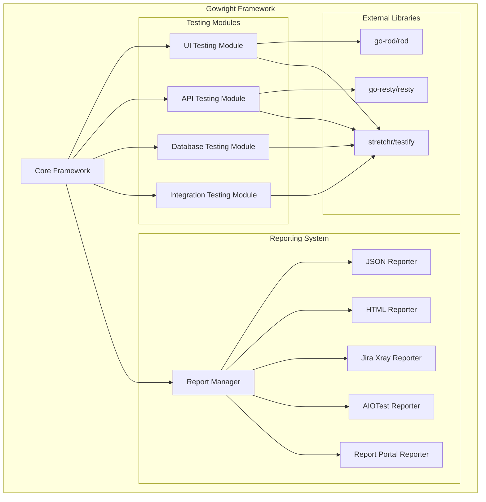

# Gowright Testing Framework Design

## Overview

Gowright is a comprehensive testing framework for Go that provides a unified interface for UI (browser, mobile), API, database, and integration testing. The framework is designed as a reusable Go module that can be integrated into multiple projects, featuring a pluggable reporting system that supports various report portals and local formats.

The framework follows a modular architecture with clear separation of concerns, allowing developers to use specific testing capabilities independently or combine them for complex integration scenarios.

## Architecture



## Components and Interfaces

### Core Framework

The core framework provides the main entry point and orchestration for all testing activities.

```go
// Gowright is the main framework struct
type Gowright struct {
    config     *Config
    reporter   *ReportManager
    testSuite  *TestSuite
}

// Config holds framework configuration
type Config struct {
    BrowserConfig   *BrowserConfig
    APIConfig      *APIConfig
    DatabaseConfig *DatabaseConfig
    ReportConfig   *ReportConfig
}

// TestSuite represents a collection of tests
type TestSuite struct {
    Name        string
    Tests       []Test
    SetupFunc   func() error
    TeardownFunc func() error
}
```

### UI Testing Module

Handles browser and mobile UI testing using go-rod/rod.

```go
// UITester provides browser automation capabilities
type UITester struct {
    browser *rod.Browser
    page    *rod.Page
    config  *BrowserConfig
}

// BrowserConfig holds browser-specific settings
type BrowserConfig struct {
    Headless    bool
    Timeout     time.Duration
    UserAgent   string
    WindowSize  *WindowSize
}

// UITest represents a UI test case
type UITest struct {
    Name        string
    URL         string
    Actions     []UIAction
    Assertions  []UIAssertion
}
```

### API Testing Module

Handles HTTP/REST API testing using go-resty/resty.

```go
// APITester provides HTTP client capabilities
type APITester struct {
    client *resty.Client
    config *APIConfig
}

// APIConfig holds API testing configuration
type APIConfig struct {
    BaseURL     string
    Timeout     time.Duration
    Headers     map[string]string
    AuthConfig  *AuthConfig
}

// APITest represents an API test case
type APITest struct {
    Name       string
    Method     string
    Endpoint   string
    Headers    map[string]string
    Body       interface{}
    Expected   *APIExpectation
}
```

### Database Testing Module

Handles database operations and validations.

```go
// DatabaseTester provides database testing capabilities
type DatabaseTester struct {
    connections map[string]*sql.DB
    config      *DatabaseConfig
}

// DatabaseConfig holds database configuration
type DatabaseConfig struct {
    Connections map[string]*DBConnection
}

// DBConnection represents a database connection config
type DBConnection struct {
    Driver       string
    DSN          string
    MaxOpenConns int
    MaxIdleConns int
}

// DatabaseTest represents a database test case
type DatabaseTest struct {
    Name        string
    Connection  string
    Setup       []string
    Query       string
    Expected    *DatabaseExpectation
    Teardown    []string
}
```

### Integration Testing Module

Orchestrates complex tests that span multiple systems.

```go
// IntegrationTester coordinates multi-system tests
type IntegrationTester struct {
    uiTester  *UITester
    apiTester *APITester
    dbTester  *DatabaseTester
}

// IntegrationTest represents a complex integration test
type IntegrationTest struct {
    Name       string
    Steps      []IntegrationStep
    Rollback   []IntegrationStep
}

// IntegrationStep represents a single step in an integration test
type IntegrationStep struct {
    Type       StepType // UI, API, Database
    Action     interface{}
    Validation interface{}
}
```

### Reporting System

Manages test result collection and distribution to various reporting destinations.

```go
// ReportManager coordinates all reporting activities
type ReportManager struct {
    config    *ReportConfig
    reporters []Reporter
    results   *TestResults
}

// Reporter interface for all report destinations
type Reporter interface {
    GenerateReport(results *TestResults) error
    GetName() string
}

// TestResults holds all test execution results
type TestResults struct {
    SuiteName    string
    StartTime    time.Time
    EndTime      time.Time
    TotalTests   int
    PassedTests  int
    FailedTests  int
    SkippedTests int
    TestCases    []TestCaseResult
}

// TestCaseResult represents individual test results
type TestCaseResult struct {
    Name        string
    Status      TestStatus
    Duration    time.Duration
    Error       error
    Screenshots []string
    Logs        []string
}
```

## Data Models

### Test Execution Flow

1. **Initialization**: Framework loads configuration and initializes required modules
2. **Setup**: Execute suite-level setup functions
3. **Test Execution**: Run individual tests with appropriate testers
4. **Result Collection**: Gather test results, screenshots, and logs
5. **Reporting**: Generate and distribute reports to configured destinations
6. **Teardown**: Execute cleanup functions

### Configuration Management

The framework uses a hierarchical configuration system:

```go
type Config struct {
    // Global settings
    LogLevel    string
    Parallel    bool
    MaxRetries  int
    
    // Module-specific configs
    Browser     *BrowserConfig
    API         *APIConfig
    Database    *DatabaseConfig
    Reporting   *ReportConfig
}

type ReportConfig struct {
    LocalReports struct {
        JSON     bool
        HTML     bool
        OutputDir string
    }
    
    RemoteReports struct {
        JiraXray     *JiraXrayConfig
        AIOTest      *AIOTestConfig
        ReportPortal *ReportPortalConfig
    }
}
```

## Error Handling

### Error Types

```go
// GowrightError represents framework-specific errors
type GowrightError struct {
    Type    ErrorType
    Message string
    Cause   error
    Context map[string]interface{}
}

type ErrorType int

const (
    ConfigurationError ErrorType = iota
    BrowserError
    APIError
    DatabaseError
    ReportingError
    AssertionError
)
```

### Error Recovery

- **Browser Errors**: Automatic retry with fresh browser instance
- **API Errors**: Configurable retry with exponential backoff
- **Database Errors**: Connection pool management and retry logic
- **Reporting Errors**: Graceful degradation, continue with available reporters

## Testing Strategy

### Unit Testing

- Test each module independently with mocked dependencies
- Use testify/mock for creating test doubles
- Achieve >90% code coverage for core functionality

### Integration Testing

- Test module interactions with real external dependencies
- Use Docker containers for database testing
- Test browser automation with headless Chrome

### End-to-End Testing

- Create sample test suites using the framework
- Validate reporting pipeline with actual report portals
- Performance testing with concurrent test execution

### Test Organization

```go
// Example test structure
func TestGowrightFramework(t *testing.T) {
    suite := &GowrightTestSuite{}
    suite.SetupSuite()
    
    t.Run("UITesting", suite.TestUIModule)
    t.Run("APITesting", suite.TestAPIModule)
    t.Run("DatabaseTesting", suite.TestDatabaseModule)
    t.Run("Integration", suite.TestIntegrationModule)
    t.Run("Reporting", suite.TestReportingModule)
    
    suite.TearDownSuite()
}
```

### Performance Considerations

- **Parallel Execution**: Support concurrent test execution with proper resource management
- **Resource Cleanup**: Automatic cleanup of browser instances, database connections, and temporary files
- **Memory Management**: Efficient handling of large test datasets and screenshots
- **Connection Pooling**: Reuse database connections and HTTP clients where possible