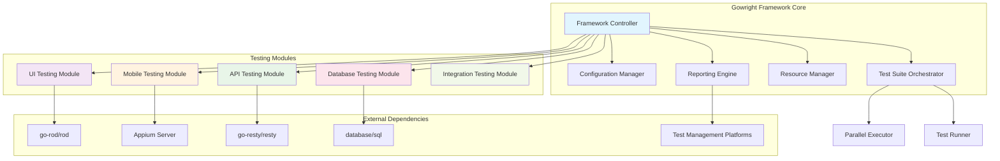
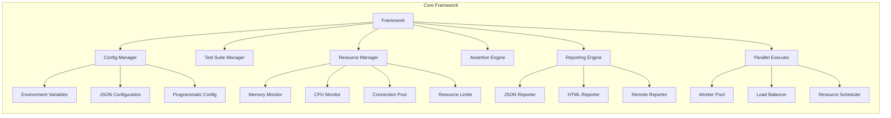
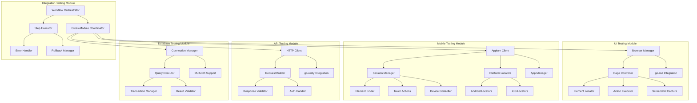
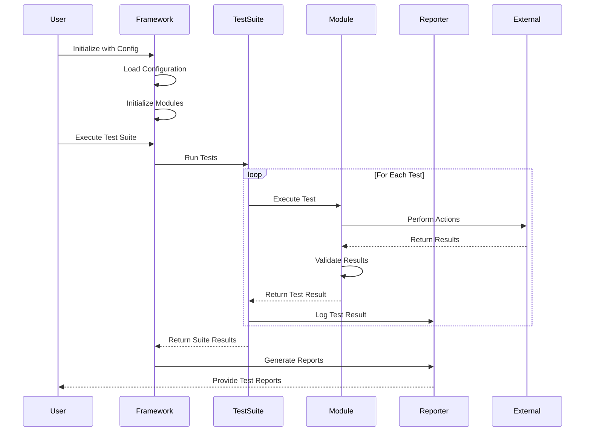
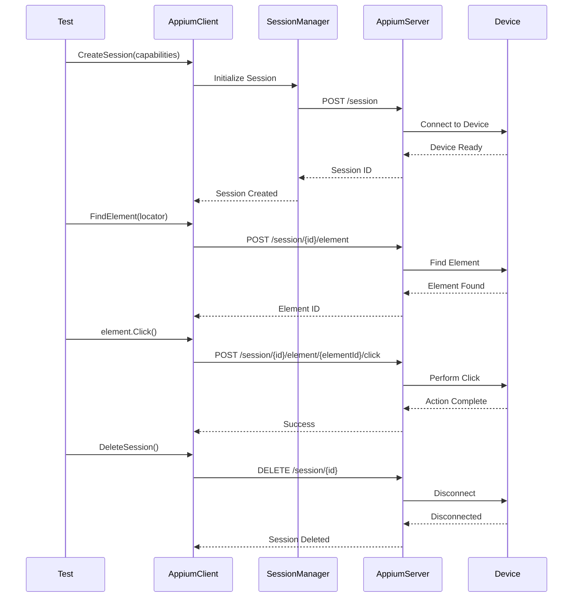
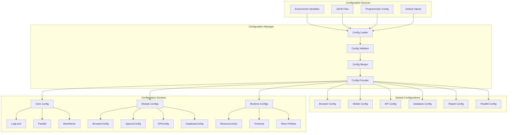
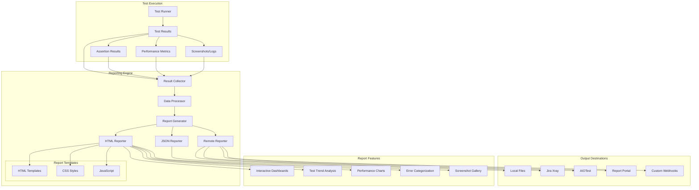
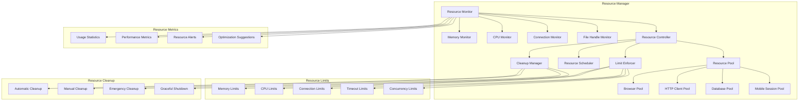
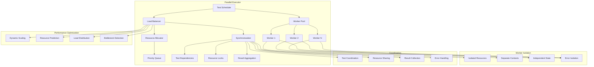

# Architecture Overview

This document provides a comprehensive overview of the Gowright testing framework architecture, including its modular design, component interactions, and data flow patterns.

## High-Level Architecture



## Module Architecture

### Core Framework Components



### Testing Module Interactions



## Mobile Testing Architecture Deep Dive

```mermaid
graph TB
    subgraph "Mobile Testing Module Architecture"
        A[AppiumClient] --> B[Session Manager]
        A --> C[Capabilities Handler]
        
        B --> D[Element Operations]
        B --> E[Touch Actions]
        B --> F[Device Management]
        B --> G[App Lifecycle]
        
        D --> D1[Element Finder]
        D --> D2[Element Interactions]
        D --> D3[Wait Conditions]
        
        E --> E1[Basic Touch]
        E --> E2[Gestures]
        E --> E3[Multi-Touch]
        
        F --> F1[Orientation Control]
        F --> F2[Keyboard Management]
        F --> F3[Screen Capture]
        
        G --> G1[App Installation]
        G --> G2[App Launch/Close]
        G --> G3[Background/Foreground]
        
        subgraph "Platform Locators"
            H[Locator Factory] --> H1[Android Locators]
            H --> H2[iOS Locators]
            H --> H3[Generic Locators]
            
            H1 --> H1A[UIAutomator Selectors]
            H1 --> H1B[Resource ID]
            H1 --> H1C[Text/Description]
            
            H2 --> H2A[Predicate Strings]
            H2 --> H2B[Class Chain]
            H2 --> H2C[Accessibility ID]
        end
        
        subgraph "Appium Server Communication"
            I[HTTP Client] --> I1[WebDriver Protocol]
            I1 --> I2[JSON Wire Protocol]
            I1 --> I3[W3C WebDriver]
        end
        
        A --> H
        B --> I
    end
    
    subgraph "External Mobile Infrastructure"
        J[Appium Server] --> J1[Android Driver]
        J --> J2[iOS Driver]
        J --> J3[Device Farm]
        
        J1 --> J1A[UIAutomator2]
        J1 --> J1B[Espresso]
        
        J2 --> J2A[XCUITest]
        J2 --> J2B[Instruments]
    end
    
    I --> J
```



## Data Flow Architecture

### Test Execution Flow



### Mobile Testing Flow



## Configuration Architecture



## Reporting Architecture



## Resource Management Architecture



## Parallel Execution Architecture



## Extension Points

The Gowright architecture provides several extension points for customization:

### Custom Test Modules
```go
type CustomModule interface {
    Initialize(config interface{}) error
    ExecuteTest(test interface{}) TestResult
    Cleanup() error
}
```

### Custom Assertions
```go
type CustomAssertion interface {
    Assert(actual, expected interface{}) AssertionResult
    GetMessage() string
}
```

### Custom Reporters
```go
type CustomReporter interface {
    GenerateReport(results TestResults) error
    GetFormat() string
}
```

### Custom Resource Monitors
```go
type CustomResourceMonitor interface {
    Monitor() ResourceUsage
    GetLimits() ResourceLimits
    Cleanup() error
}
```

## Design Principles

### Modularity
Each testing module is self-contained and can be used independently or in combination with others.

### Extensibility
Well-defined interfaces allow for custom implementations and third-party integrations.

### Performance
Resource management and parallel execution ensure efficient test execution even at scale.

### Reliability
Comprehensive error handling, retry mechanisms, and resource cleanup ensure robust test execution.

### Observability
Detailed logging, metrics, and reporting provide visibility into test execution and system behavior.

This architecture enables Gowright to provide a unified, scalable, and maintainable testing framework that can adapt to diverse testing requirements while maintaining high performance and reliability.