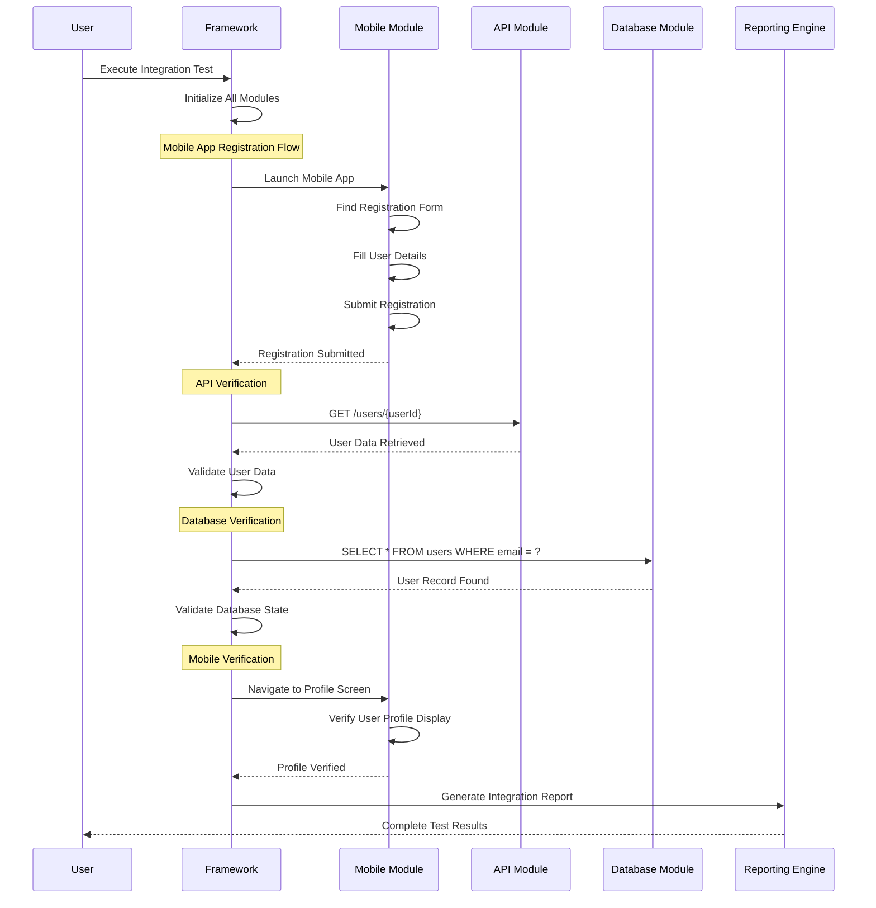
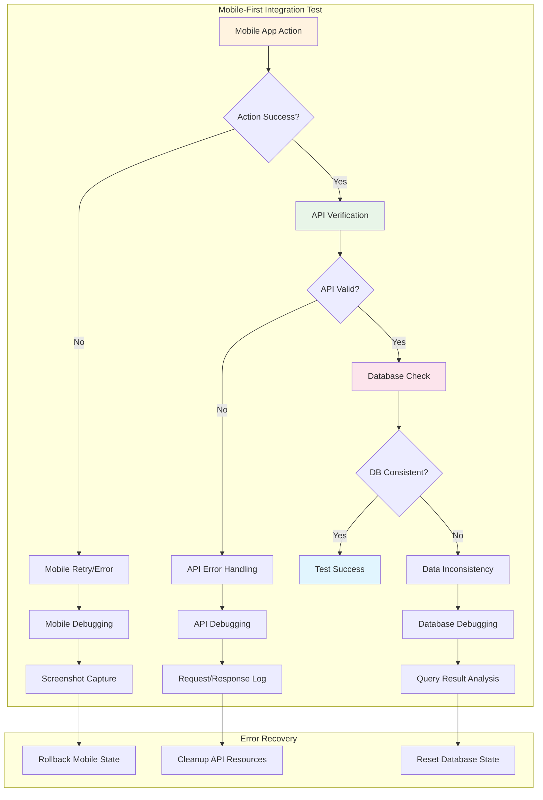
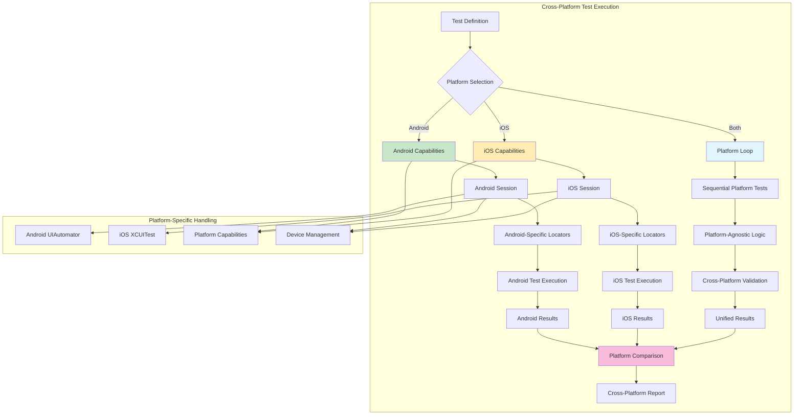
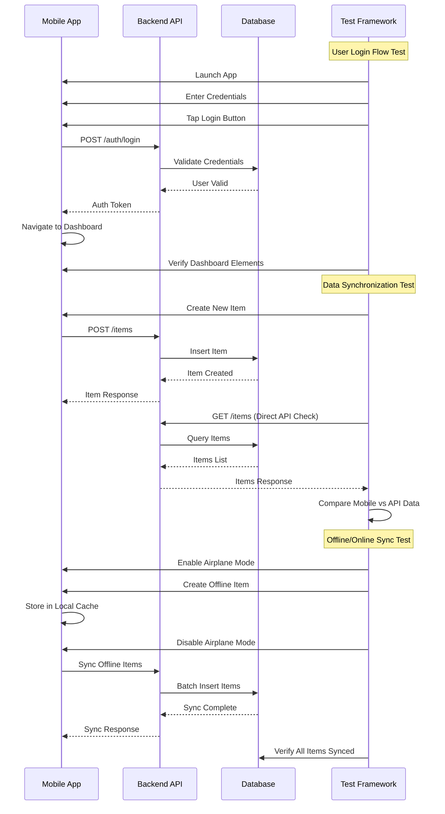
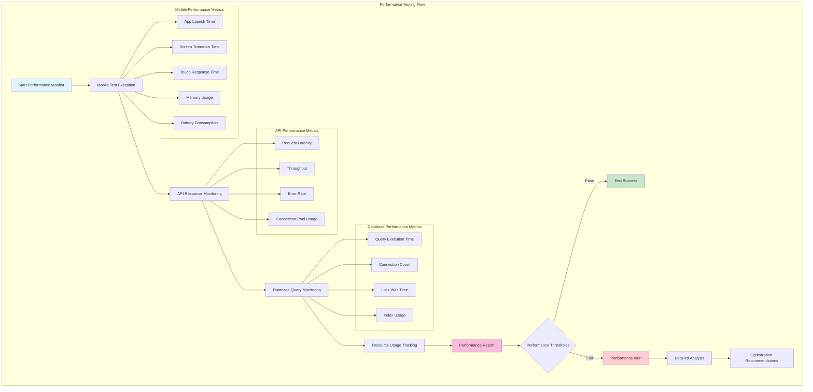
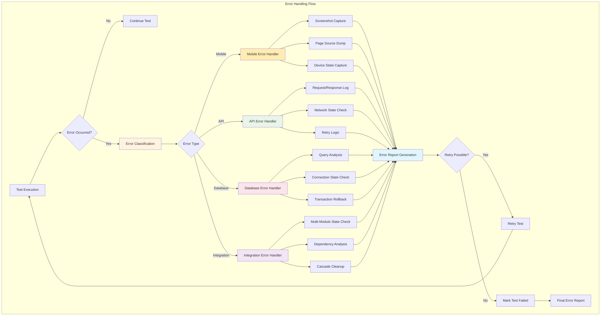
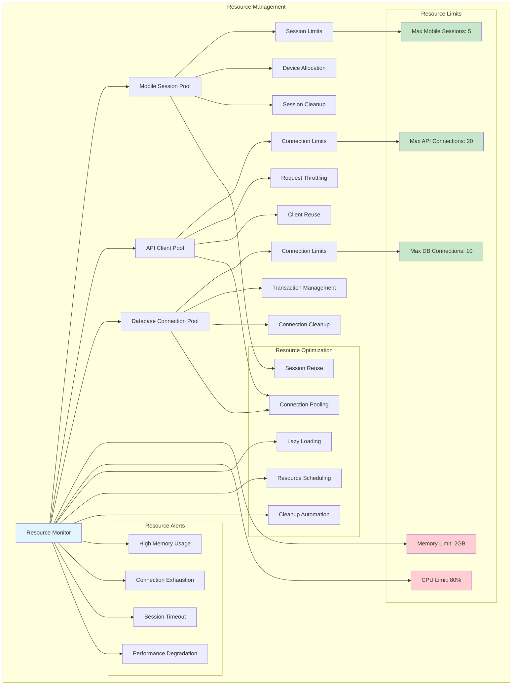
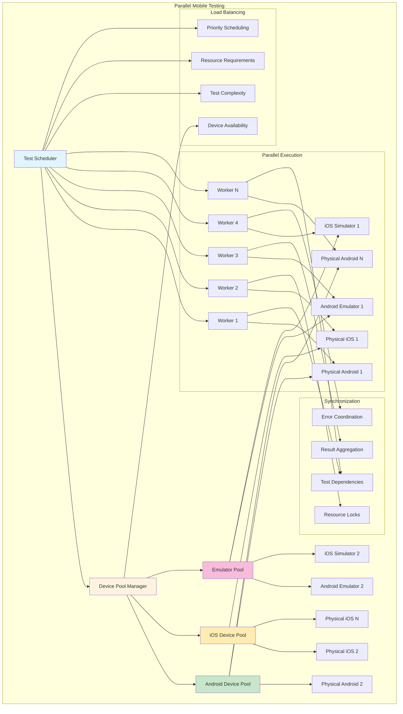

# Integration Flow Diagrams

This document provides visual representations of how different testing modules integrate within the Gowright framework, with special focus on mobile testing integration patterns.

## Complete Integration Testing Flow

## Mobile-First Integration Pattern

## Cross-Platform Mobile Testing Flow

## Mobile Testing with API Backend Integration

## Performance Testing Integration

## Error Handling and Recovery Flow

## Resource Management in Mobile Testing

## Parallel Mobile Testing Architecture

These diagrams illustrate the comprehensive integration patterns and architectural flows within the Gowright framework, highlighting how mobile testing seamlessly integrates with other testing modules to provide end-to-end testing capabilities.