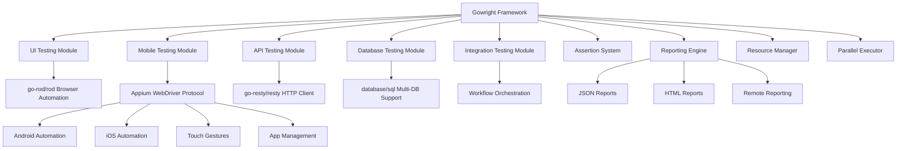

# Introduction to Gowright

Gowright is a comprehensive testing framework for Go that unifies testing across multiple domains: UI automation, API testing, database validation, and integration workflows. It's designed to provide a single, cohesive solution for all your testing needs.

## Why Gowright?

Traditional Go testing often requires multiple tools and frameworks:
- Browser automation with Selenium or Playwright
- API testing with custom HTTP clients
- Database testing with raw SQL or ORM-specific tools
- Integration testing with complex orchestration

Gowright consolidates these into a single, unified framework with consistent APIs and shared configuration.

## Core Philosophy

### Simplicity First
Gowright prioritizes ease of use without sacrificing power. Complex testing scenarios should be expressible in clear, readable code.

### Performance Focused
Built for speed with parallel execution, resource management, and efficient browser automation using Chrome DevTools Protocol.

### Extensible Architecture
Modular design allows you to use only what you need while providing extension points for custom functionality.

### Developer Experience
Rich reporting, detailed error messages, and comprehensive debugging tools make test development and maintenance enjoyable.

## Architecture Overview



## Key Components

### Testing Modules

**UI Testing**
- Browser automation using Chrome DevTools Protocol
- Web application testing and form handling
- Screenshot capture and visual validation
- Element interaction and page navigation

**Mobile Testing**
- Native mobile app automation using Appium WebDriver protocol
- Cross-platform support for Android and iOS
- Touch gestures and mobile-specific interactions
- App lifecycle management and device control

**API Testing**
- HTTP/REST endpoint testing
- JSON/XML response validation
- Authentication handling
- Request/response logging

**Database Testing**
- Multi-database support (PostgreSQL, MySQL, SQLite, etc.)
- Transaction management and rollback testing
- Complex query validation
- Data integrity testing

**Integration Testing**
- Multi-system workflow orchestration
- Cross-module test coordination
- Error handling and rollback mechanisms
- Performance testing across systems

### Core Features

**Assertion System**
- Rich assertion methods with detailed error messages
- Custom assertion support
- Step-by-step validation tracking

**Reporting Engine**
- Professional HTML reports with interactive features
- Machine-readable JSON reports
- Remote reporting to test management platforms
- Screenshot and log attachment

**Resource Management**
- Memory and CPU monitoring
- Connection pooling and resource limits
- Automatic cleanup and garbage collection

**Parallel Execution**
- Concurrent test execution with resource isolation
- Configurable concurrency limits
- Load balancing and resource allocation

## Use Cases

### Web Application Testing
Test complete web applications from UI interactions to database persistence:

```go
// Test user registration workflow
integrationTest := &gowright.IntegrationTest{
    Name: "User Registration Workflow",
    Steps: []gowright.IntegrationStep{
        // UI: Fill registration form
        {Type: gowright.StepTypeUI, /* ... */},
        // API: Verify user creation
        {Type: gowright.StepTypeAPI, /* ... */},
        // DB: Confirm data persistence
        {Type: gowright.StepTypeDatabase, /* ... */},
    },
}
```

### API Service Testing
Comprehensive API testing with database validation:

```go
// Test API endpoint with database verification
apiTest := gowright.NewAPITestBuilder("Create User", "POST", "/users").
    WithBody(userData).
    ExpectStatus(http.StatusCreated).
    ExpectJSONPath("$.id", gowright.NotNil).
    WithDatabaseValidation("users", "SELECT COUNT(*) FROM users WHERE email = ?", userEmail).
    Build()
```

### Mobile Application Testing
Test native mobile applications with cross-platform support:

```go
// Test mobile app login workflow
func testMobileLogin(platform string) {
    client := gowright.NewAppiumClient("http://localhost:4723")
    
    var caps gowright.AppiumCapabilities
    if platform == "Android" {
        caps = gowright.AppiumCapabilities{
            PlatformName: "Android",
            DeviceName:   "emulator-5554",
            AppPackage:   "com.example.app",
            AppActivity:  ".LoginActivity",
        }
    } else {
        caps = gowright.AppiumCapabilities{
            PlatformName: "iOS",
            DeviceName:   "iPhone 13 Simulator",
            BundleID:     "com.example.app",
        }
    }
    
    client.CreateSession(ctx, caps)
    defer client.DeleteSession(ctx)
    
    // Platform-agnostic element finding
    var loginButton *gowright.AppiumElement
    if platform == "Android" {
        by, value := gowright.Android.Text("Login")
        loginButton, _ = client.FindElement(ctx, by, value)
    } else {
        by, value := gowright.IOS.Label("Login")
        loginButton, _ = client.FindElement(ctx, by, value)
    }
    
    loginButton.Click(ctx)
}
```

### Database Migration Testing
Validate database schema changes and data migrations:

```go
// Test database migration
migrationTest := &gowright.DatabaseTest{
    Name: "User Table Migration",
    Setup: []string{
        "CREATE TABLE users_backup AS SELECT * FROM users",
    },
    Migration: []string{
        "ALTER TABLE users ADD COLUMN created_at TIMESTAMP DEFAULT NOW()",
    },
    Validation: &gowright.DatabaseExpectation{
        ColumnExists: []string{"created_at"},
        RowCount: gowright.GreaterThan(0),
    },
}
```

### Performance Testing
Monitor performance across all testing modules:

```go
// Performance test with resource monitoring
config := &gowright.Config{
    ResourceLimits: gowright.ResourceLimits{
        MaxMemoryMB:     512,
        MaxCPUPercent:   70,
        MaxResponseTime: 2 * time.Second,
    },
}
```

## Getting Started

Ready to start using Gowright? Continue with:

1. [Installation](installation.md) - Set up Gowright in your project
2. [Quick Start](quick-start.md) - Your first Gowright test
3. [Configuration](configuration.md) - Configure Gowright for your needs

Or jump directly to specific testing modules:

- [API Testing](../testing-modules/api-testing.md)
- [UI Testing](../testing-modules/ui-testing.md)
- [Mobile Testing](../testing-modules/mobile-testing.md)
- [Database Testing](../testing-modules/database-testing.md)
- [Integration Testing](../testing-modules/integration-testing.md)