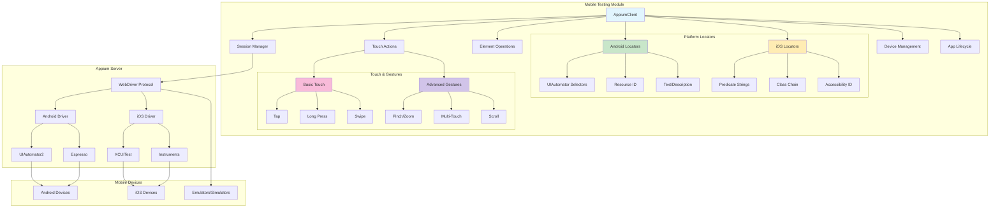

# Mobile Testing with Appium

The GoWright framework provides comprehensive mobile application testing capabilities through its Appium integration. This module enables automated testing of native mobile applications on both Android and iOS platforms using the industry-standard Appium WebDriver protocol.

## Overview

The mobile testing module offers:

- **Cross-platform support**: Test Android and iOS applications with the same API
- **Native app automation**: Direct interaction with native mobile elements
- **Touch gestures**: Comprehensive support for mobile-specific interactions
- **Device management**: Handle device orientation, keyboard, and app lifecycle
- **Smart locators**: Platform-specific element finding strategies
- **Screenshot capture**: Visual validation and debugging support
- **Wait conditions**: Reliable element synchronization

## Architecture



## Quick Start

### Prerequisites

Before using the mobile testing module, ensure you have:

1. **Appium Server** running (typically on `http://localhost:4723`)
2. **Android SDK** (for Android testing)
3. **Xcode** (for iOS testing on macOS)
4. **Device/Emulator** configured and accessible

### Basic Setup

```go
package main

import (
    "context"
    "log"
    "time"
    
    "github.com/gowright/framework/pkg/gowright"
)

func main() {
    // Create Appium client
    client := gowright.NewAppiumClient("http://localhost:4723")
    ctx := context.Background()
    
    // Define capabilities for Android
    caps := gowright.AppiumCapabilities{
        PlatformName:   "Android",
        DeviceName:     "emulator-5554",
        AppPackage:     "com.android.calculator2",
        AppActivity:    ".Calculator",
        AutomationName: "UiAutomator2",
    }
    
    // Create session
    if err := client.CreateSession(ctx, caps); err != nil {
        log.Fatal(err)
    }
    defer client.DeleteSession(ctx)
    
    // Your test automation code here
    log.Println("Mobile session created successfully!")
}
```

## Capabilities Configuration

### Android Capabilities

```go
caps := gowright.AppiumCapabilities{
    PlatformName:      "Android",
    PlatformVersion:   "11",                    // Android version
    DeviceName:        "emulator-5554",         // Device identifier
    App:               "/path/to/app.apk",      // APK path (optional)
    AppPackage:        "com.example.app",       // Package name
    AppActivity:       ".MainActivity",         // Main activity
    AutomationName:    "UiAutomator2",         // Automation engine
    NoReset:           true,                    // Don't reset app state
    FullReset:         false,                   // Don't uninstall app
    NewCommandTimeout: 60,                      // Command timeout (seconds)
}
```

### iOS Capabilities

```go
caps := gowright.AppiumCapabilities{
    PlatformName:      "iOS",
    PlatformVersion:   "15.0",                  // iOS version
    DeviceName:        "iPhone 13 Simulator",  // Device name
    App:               "/path/to/app.app",      // App path (optional)
    BundleID:          "com.example.app",       // Bundle identifier
    AutomationName:    "XCUITest",             // Automation engine
    NoReset:           true,                    // Don't reset app state
    NewCommandTimeout: 60,                      // Command timeout (seconds)
}
```

## Element Locators

### Basic Locator Strategies

```go
// By ID (resource ID for Android, accessibility ID for iOS)
element, err := client.FindElement(ctx, gowright.ByID, "button-id")

// By XPath
element, err := client.FindElement(ctx, gowright.ByXPath, "//button[@text='Click me']")

// By Class Name
element, err := client.FindElement(ctx, gowright.ByClassName, "android.widget.Button")

// By Accessibility ID (cross-platform)
element, err := client.FindElement(ctx, gowright.ByAccessibilityID, "accessibility-id")

// By Name
element, err := client.FindElement(ctx, gowright.ByName, "element-name")

// By Tag Name
element, err := client.FindElement(ctx, gowright.ByTagName, "button")
```

### Platform-Specific Locators

#### Android Locators

```go
// Resource ID
by, value := gowright.Android.ResourceID("com.example:id/button")
element, err := client.FindElement(ctx, by, value)

// Text content
by, value := gowright.Android.Text("Click me")
element, err := client.FindElement(ctx, by, value)

// Text contains
by, value := gowright.Android.TextContains("Click")
element, err := client.FindElement(ctx, by, value)

// Text starts with
by, value := gowright.Android.TextStartsWith("Click")
element, err := client.FindElement(ctx, by, value)

// Content description
by, value := gowright.Android.Description("Button description")
element, err := client.FindElement(ctx, by, value)

// Content description contains
by, value := gowright.Android.DescriptionContains("Button")
element, err := client.FindElement(ctx, by, value)

// Class name with UIAutomator
by, value := gowright.Android.ClassName("android.widget.Button")
element, err := client.FindElement(ctx, by, value)

// Element by index
by, value := gowright.Android.Index(0)
element, err := client.FindElement(ctx, by, value)
```

#### iOS Locators

```go
// Label
by, value := gowright.IOS.Label("Button Label")
element, err := client.FindElement(ctx, by, value)

// Label contains
by, value := gowright.IOS.LabelContains("Button")
element, err := client.FindElement(ctx, by, value)

// Name
by, value := gowright.IOS.Name("button-name")
element, err := client.FindElement(ctx, by, value)

// Name contains
by, value := gowright.IOS.NameContains("button")
element, err := client.FindElement(ctx, by, value)

// Value
by, value := gowright.IOS.Value("button-value")
element, err := client.FindElement(ctx, by, value)

// Value contains
by, value := gowright.IOS.ValueContains("value")
element, err := client.FindElement(ctx, by, value)

// Element type
by, value := gowright.IOS.Type("XCUIElementTypeButton")
element, err := client.FindElement(ctx, by, value)

// Visible elements only
by, value := gowright.IOS.Visible()
elements, err := client.FindElements(ctx, by, value)

// Enabled elements only
by, value := gowright.IOS.Enabled()
elements, err := client.FindElements(ctx, by, value)
```

## Element Interactions

### Basic Actions

```go
// Click/Tap element
err := element.Click(ctx)

// Send text to element
err := element.SendKeys(ctx, "Hello World")

// Clear text from element
err := element.Clear(ctx)

// Get element text
text, err := element.GetText(ctx)

// Get element attribute
value, err := element.GetAttribute(ctx, "enabled")
```

### Element State Queries

```go
// Check if element is displayed
displayed, err := element.IsDisplayed(ctx)

// Check if element is enabled
enabled, err := element.IsEnabled(ctx)

// Check if element is selected
selected, err := element.IsSelected(ctx)

// Get element size
width, height, err := element.GetSize(ctx)

// Get element location
x, y, err := element.GetLocation(ctx)
```

### Child Element Finding

```go
// Find child element within parent
child, err := element.FindChildElement(ctx, gowright.ByClassName, "android.widget.TextView")

// Find multiple child elements
children, err := element.FindChildElements(ctx, gowright.ByTagName, "button")
```

## Touch Actions and Gestures

### Basic Touch Actions

```go
// Tap at specific coordinates
err := client.Tap(ctx, 100, 200)

// Long press at coordinates
err := client.LongPress(ctx, 100, 200, 2000) // 2 seconds

// Swipe gesture
err := client.Swipe(ctx, 100, 200, 300, 400, 1000) // 1 second duration
```

### Advanced Gestures

```go
// Pinch gesture (zoom out)
err := client.Pinch(ctx, 200, 300)

// Zoom gesture (zoom in)
err := client.Zoom(ctx, 200, 300)

// Scroll to element with text
err := client.ScrollTo(ctx, "element-text")

// Long press with duration
err := client.LongPress(ctx, 100, 200, 2000) // 2 seconds
```

## Wait Conditions

### Smart Waiting

```go
// Wait for element to be present
element, err := client.WaitForElement(ctx, gowright.ByID, "button-id", 10*time.Second)

// Wait for element to be visible
element, err := client.WaitForElementVisible(ctx, gowright.ByID, "button-id", 10*time.Second)

// Wait for element to be clickable (visible and enabled)
element, err := client.WaitForElementClickable(ctx, gowright.ByID, "button-id", 10*time.Second)
```

## Device Management

### Screen and Orientation

```go
// Get current window size
width, height, err := client.GetWindowSize(ctx)

// Get device orientation
orientation, err := client.GetOrientation(ctx) // "PORTRAIT" or "LANDSCAPE"

// Set device orientation
err := client.SetOrientation(ctx, "LANDSCAPE")
```

### Keyboard Management

```go
// Hide on-screen keyboard
err := client.HideKeyboard(ctx)

// Check if keyboard is displayed
shown, err := client.IsKeyboardShown(ctx)
```

### Android-Specific Device Operations

```go
// Get current activity
activity, err := client.GetCurrentActivity(ctx)

// Get current package
packageName, err := client.GetCurrentPackage(ctx)

// Start specific activity
err := client.StartActivity(ctx, "com.example.app", ".MainActivity")
```

## App Management

### App Lifecycle

```go
// Launch app
err := client.LaunchApp(ctx)

// Close current app
err := client.CloseApp(ctx)

// Reset app to initial state
err := client.ResetApp(ctx)

// Put app in background for specified seconds
err := client.BackgroundApp(ctx, 5)
```

### App Installation

```go
// Install app from file
err := client.InstallApp(ctx, "/path/to/app.apk")

// Check if app is installed
installed, err := client.IsAppInstalled(ctx, "com.example.app")

// Remove app from device
err := client.RemoveApp(ctx, "com.example.app")
```

## Screenshots and Debugging

### Screenshot Capture

```go
// Take screenshot (returns base64 string)
screenshot, err := client.TakeScreenshot(ctx)

// Save screenshot to file
err := client.SaveScreenshot(ctx, "/path/to/screenshot.png")
```

### Page Source

```go
// Get current page source/XML hierarchy
source, err := client.GetPageSource(ctx)
fmt.Println(source) // Useful for debugging element structure
```

## Complete Testing Examples

### Android Calculator Test

```go
func TestAndroidCalculator(t *testing.T) {
    client := gowright.NewAppiumClient("http://localhost:4723")
    ctx := context.Background()
    
    caps := gowright.AppiumCapabilities{
        PlatformName:   "Android",
        DeviceName:     "emulator-5554",
        AppPackage:     "com.android.calculator2",
        AppActivity:    ".Calculator",
        AutomationName: "UiAutomator2",
    }
    
    err := client.CreateSession(ctx, caps)
    require.NoError(t, err)
    defer client.DeleteSession(ctx)
    
    // Perform calculation: 5 + 3 = 8
    num5, err := client.FindElement(ctx, gowright.ByID, "com.android.calculator2:id/digit_5")
    require.NoError(t, err)
    err = num5.Click(ctx)
    require.NoError(t, err)
    
    plus, err := client.FindElement(ctx, gowright.ByID, "com.android.calculator2:id/op_add")
    require.NoError(t, err)
    err = plus.Click(ctx)
    require.NoError(t, err)
    
    num3, err := client.FindElement(ctx, gowright.ByID, "com.android.calculator2:id/digit_3")
    require.NoError(t, err)
    err = num3.Click(ctx)
    require.NoError(t, err)
    
    equals, err := client.FindElement(ctx, gowright.ByID, "com.android.calculator2:id/eq")
    require.NoError(t, err)
    err = equals.Click(ctx)
    require.NoError(t, err)
    
    // Verify result
    result, err := client.FindElement(ctx, gowright.ByID, "com.android.calculator2:id/result")
    require.NoError(t, err)
    
    resultText, err := result.GetText(ctx)
    require.NoError(t, err)
    assert.Equal(t, "8", resultText)
}
```

### iOS Calculator Test

```go
func TestiOSCalculator(t *testing.T) {
    client := gowright.NewAppiumClient("http://localhost:4723")
    ctx := context.Background()
    
    caps := gowright.AppiumCapabilities{
        PlatformName:   "iOS",
        DeviceName:     "iPhone 13 Simulator",
        BundleID:       "com.apple.calculator",
        AutomationName: "XCUITest",
    }
    
    err := client.CreateSession(ctx, caps)
    require.NoError(t, err)
    defer client.DeleteSession(ctx)
    
    // Perform calculation: 7 + 2 = 9
    num7, err := client.FindElement(ctx, gowright.ByAccessibilityID, "7")
    require.NoError(t, err)
    err = num7.Click(ctx)
    require.NoError(t, err)
    
    plus, err := client.FindElement(ctx, gowright.ByAccessibilityID, "+")
    require.NoError(t, err)
    err = plus.Click(ctx)
    require.NoError(t, err)
    
    num2, err := client.FindElement(ctx, gowright.ByAccessibilityID, "2")
    require.NoError(t, err)
    err = num2.Click(ctx)
    require.NoError(t, err)
    
    equals, err := client.FindElement(ctx, gowright.ByAccessibilityID, "=")
    require.NoError(t, err)
    err = equals.Click(ctx)
    require.NoError(t, err)
    
    // Verify result would be implementation-specific
}
```

### Mobile Web Testing

```go
func TestMobileWeb(t *testing.T) {
    client := gowright.NewAppiumClient("http://localhost:4723")
    ctx := context.Background()
    
    caps := gowright.AppiumCapabilities{
        PlatformName:   "Android",
        DeviceName:     "emulator-5554",
        AutomationName: "UiAutomator2",
    }
    
    err := client.CreateSession(ctx, caps)
    require.NoError(t, err)
    defer client.DeleteSession(ctx)
    
    // Open Chrome browser
    err = client.StartActivity(ctx, "com.android.chrome", "com.google.android.apps.chrome.Main")
    require.NoError(t, err)
    
    time.Sleep(3 * time.Second)
    
    // Navigate to website
    addressBar, err := client.WaitForElement(ctx, gowright.ByID, "com.android.chrome:id/url_bar", 10*time.Second)
    require.NoError(t, err)
    
    err = addressBar.Click(ctx)
    require.NoError(t, err)
    
    err = addressBar.SendKeys(ctx, "https://example.com")
    require.NoError(t, err)
    
    // Additional web testing logic...
}
```

## Integration with GoWright Framework

### Using with Test Suites

```go
func TestMobileAppSuite(t *testing.T) {
    suite := gowright.NewTestSuite("Mobile App Tests")
    
    suite.AddTest("Login Test", func(tc *gowright.TestContext) {
        client := gowright.NewAppiumClient("http://localhost:4723")
        ctx := context.Background()
        
        caps := gowright.AppiumCapabilities{
            PlatformName: "Android",
            DeviceName:   "emulator-5554",
            AppPackage:   "com.example.app",
            AppActivity:  ".LoginActivity",
        }
        
        err := client.CreateSession(ctx, caps)
        tc.AssertNoError(err, "Should create Appium session")
        defer client.DeleteSession(ctx)
        
        // Test login functionality
        usernameField, err := client.FindElement(ctx, gowright.ByID, "username")
        tc.AssertNoError(err, "Should find username field")
        
        err = usernameField.SendKeys(ctx, "testuser")
        tc.AssertNoError(err, "Should enter username")
        
        passwordField, err := client.FindElement(ctx, gowright.ByID, "password")
        tc.AssertNoError(err, "Should find password field")
        
        err = passwordField.SendKeys(ctx, "testpass")
        tc.AssertNoError(err, "Should enter password")
        
        loginButton, err := client.FindElement(ctx, gowright.ByID, "login-button")
        tc.AssertNoError(err, "Should find login button")
        
        err = loginButton.Click(ctx)
        tc.AssertNoError(err, "Should click login button")
        
        // Wait for successful login
        welcomeMessage, err := client.WaitForElement(ctx, gowright.ByID, "welcome-message", 10*time.Second)
        tc.AssertNoError(err, "Should see welcome message after login")
        
        text, err := welcomeMessage.GetText(ctx)
        tc.AssertNoError(err, "Should get welcome message text")
        tc.AssertContains(text, "Welcome", "Welcome message should contain 'Welcome'")
    })
    
    results := suite.Run()
    assert.Equal(t, 1, results.Passed)
    assert.Equal(t, 0, results.Failed)
}
```

## Best Practices

### 1. Session Management

```go
// Always clean up sessions
defer func() {
    if err := client.DeleteSession(ctx); err != nil {
        log.Printf("Failed to delete session: %v", err)
    }
}()
```

### 2. Use Smart Waits

```go
// Prefer smart waits over sleep
element, err := client.WaitForElementClickable(ctx, gowright.ByID, "button", 10*time.Second)
// Instead of: time.Sleep(5 * time.Second)
```

### 3. Platform-Specific Locators

```go
// Use platform-specific helpers for better reliability
var by, value string
if platform == "Android" {
    by, value = gowright.Android.Text("Click me")
} else {
    by, value = gowright.IOS.Label("Click me")
}
element, err := client.FindElement(ctx, by, value)
```

### 4. Error Handling

```go
// Always check for errors and provide context
element, err := client.FindElement(ctx, gowright.ByID, "button")
if err != nil {
    return fmt.Errorf("failed to find login button: %w", err)
}
```

### 5. Resource Management

```go
// Use context for timeouts and cancellation
ctx, cancel := context.WithTimeout(context.Background(), 30*time.Second)
defer cancel()

err := client.CreateSession(ctx, caps)
```

## Troubleshooting

### Common Issues

1. **Session creation fails**: Check Appium server is running and device is connected
2. **Element not found**: Verify element locators and wait for dynamic content
3. **Touch actions fail**: Ensure coordinates are within screen bounds
4. **App installation fails**: Check app permissions and device storage

### Debug Tips

```go
// Enable debug logging
// Set environment variable: APPIUM_LOG_LEVEL=debug

// Capture page source for debugging
source, err := client.GetPageSource(ctx)
if err == nil {
    log.Printf("Page source: %s", source)
}

// Take screenshot on failure
if err != nil {
    screenshot, _ := client.TakeScreenshot(ctx)
    // Save screenshot for analysis
}
```

### Performance Optimization

- Reuse sessions when possible
- Use efficient locator strategies
- Minimize unnecessary waits
- Clean up resources promptly
- Use parallel execution for independent tests

## Requirements

- **Appium Server**: Version 1.22+ recommended
- **Android SDK**: For Android testing
- **Xcode**: For iOS testing (macOS only)
- **Device/Emulator**: Properly configured and accessible
- **Network**: Stable connection between test runner and Appium server

The mobile testing module provides comprehensive automation capabilities for native mobile applications, enabling reliable and maintainable test suites across Android and iOS platforms.